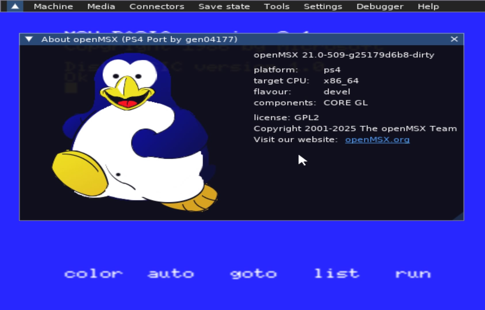

# openmsx-ps4

 

	

A port of [openMSX](https://openmsx.org/) to the PS4.

## Controls:

**Left Stick:** move menu cursor

**X:** left-click

**O:** right-click

**Right Stick:** scroll the window/list under the cursor

> **Recommended:** MSX games expect keyboard input, and BASIC and MSX-DOS are keyboard-driven environments — the controller alone is only meant for navigating the openMSX menu.

## Credits + Special Thanks

- [openMSX](https://openmsx.org/) & [OpenOrbis](https://github.com/OpenOrbis/OpenOrbis-PS4-Toolchain) Team.
